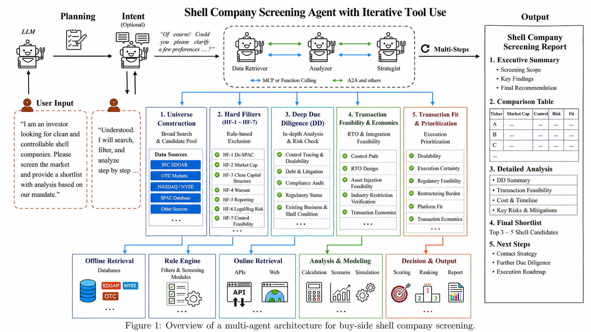

# Shell Company Screening Agent

A Deep Research agent for identifying, screening, and evaluating listed shell companies as potential acquisition targets in M&A transactions.

The agent supports OpenAI, OpenRouter, Gemini, and Perplexity Deep Research providers. It takes a transaction mandate at runtime and produces a structured screening report.

## Agent Workflow



## Quick Start

Create and activate a virtual environment:

```powershell
python -m venv .venv
.venv\Scripts\activate
```

Install dependencies:

```powershell
pip install -r requirements.txt
```

Run the agent:

```powershell
python -m runtime.main
```

The runtime will prompt for the screening mandate, Deep Research provider, model, and API key.

## Outputs

Research outputs are saved to the `output/` directory.

The agent generates:

- Markdown screening report
- DOCX screening report
- PDF screening report
- Evidence JSON containing structured citations, sources, and provider metadata

> PDF generation requires Microsoft Word on Windows. If PDF conversion fails, the completed Markdown, Evidence JSON, and available DOCX outputs are still preserved.
- PDF

> PDF generation requires Microsoft 
